# 09. フロー図集

設計書 docs/01〜08 のフローとデータ構造を Mermaid で図にしたものです。GitHub 上でそのまま描画されます。
**設計を変更したときは、対応する図をこのファイルで必ず更新します**(ルールは CLAUDE.md)。

| # | 図 | 対応する設計書 |
|---|---|---|
| 1a/1b | 全体構成(本番経路 / 評価・アノテーション経路) | docs/01 |
| 2 | 内側ループと外側ループ | docs/01, 07 |
| 3 | データモデル | docs/02 |
| 4 | 子フロー: レビュー実行 | docs/03 1節, 08 3節 |
| 5 | F1 評価実行 | docs/03 2節 |
| 6 | F2 フィードバック記録(本番: F2b Teams 投稿が既定) | docs/03 3節, 07 3.2節, 10 |
| 7 | F3 人判定依頼 | docs/03 4節, 07 3.1節・4節 |
| 8 | F4 フィードバック・トリアージ | docs/03 5節 |
| 9 | F6 週次集約 | docs/03 7節, 08 8節 |
| 10 | F0 テストケース登録(任意) | docs/03 6節 |
| 11 | 期待指摘のライフサイクル | docs/07 2節 |
| 12 | アノテーション結果の活用 | docs/08 9節 |
| 13 | リリース手順 | docs/06 6節 |

## 1. 全体構成

全体を「本番経路」と「評価・アノテーション経路」の2図に分けています。両者は Dataverse のゴールデンセットで繋がります。

### 1a. 本番経路(利用者がレビューを受ける)

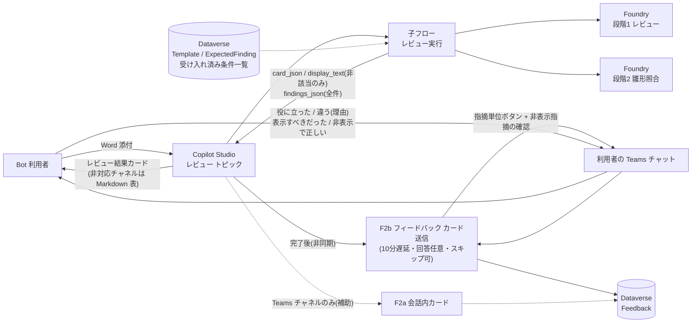

### 1b. 評価・アノテーション経路(開発者と業務部門)

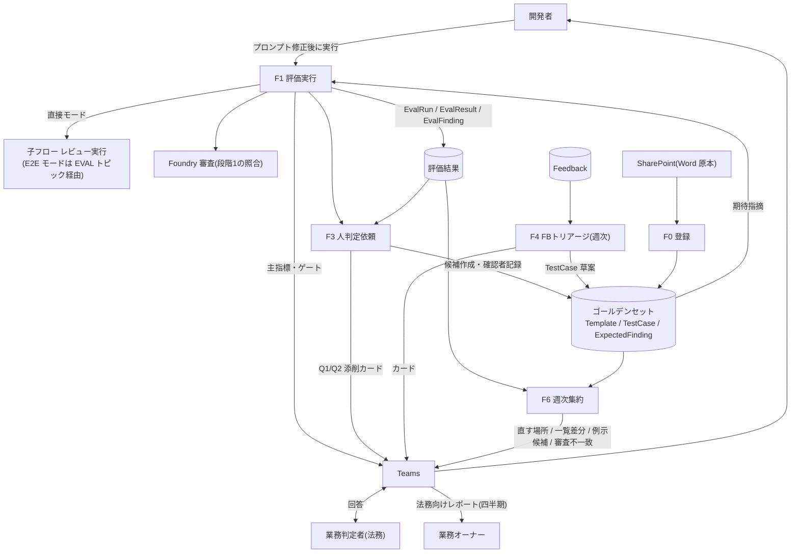

## 2. 内側ループと外側ループ

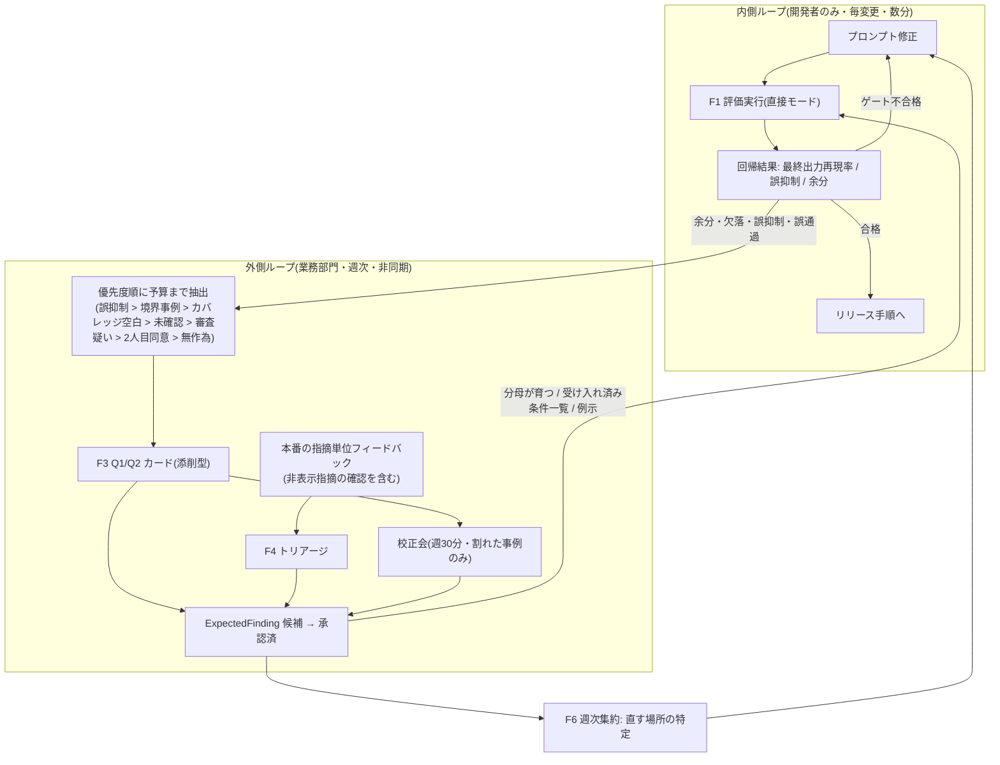

## 3. データモデル

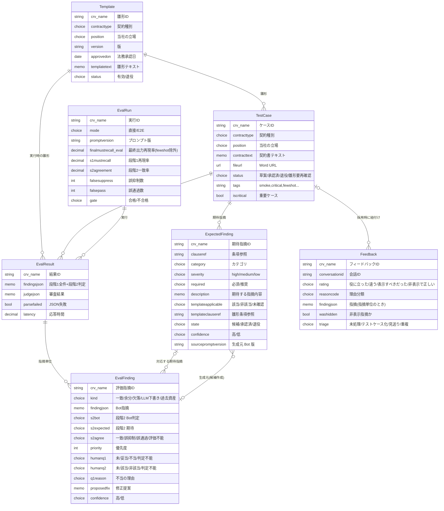

## 4. 子フロー: レビュー実行

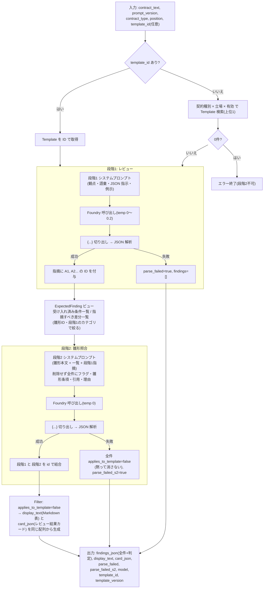

## 5. F1 評価実行

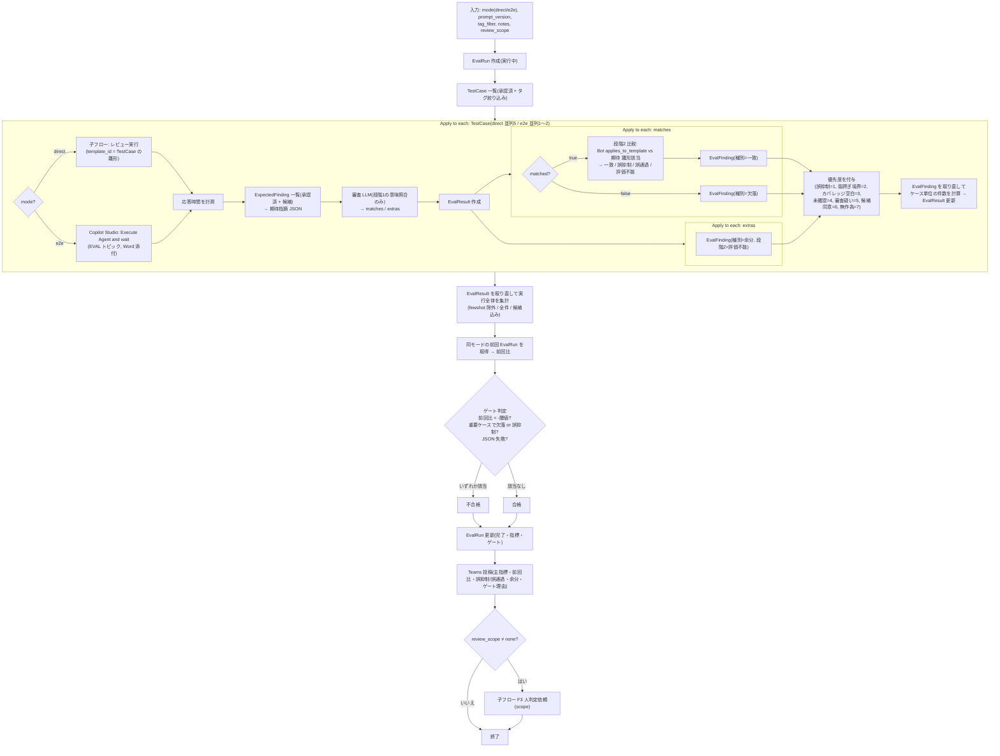

## 6. F2 フィードバック記録(本番)

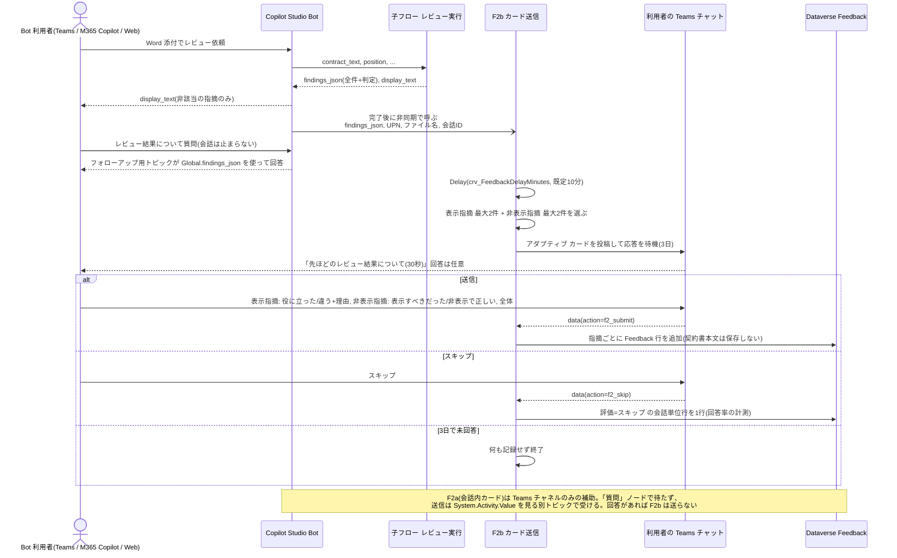

## 7. F3 人判定依頼(指摘単位の Q1 / Q2)

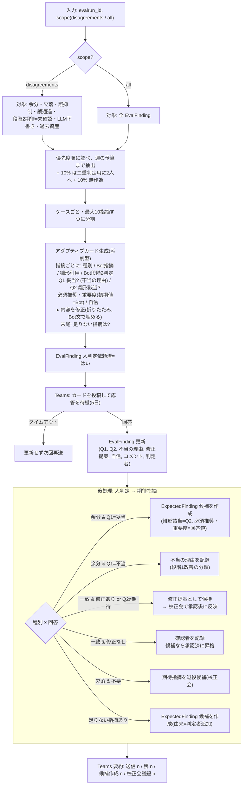

## 8. F4 フィードバック・トリアージ

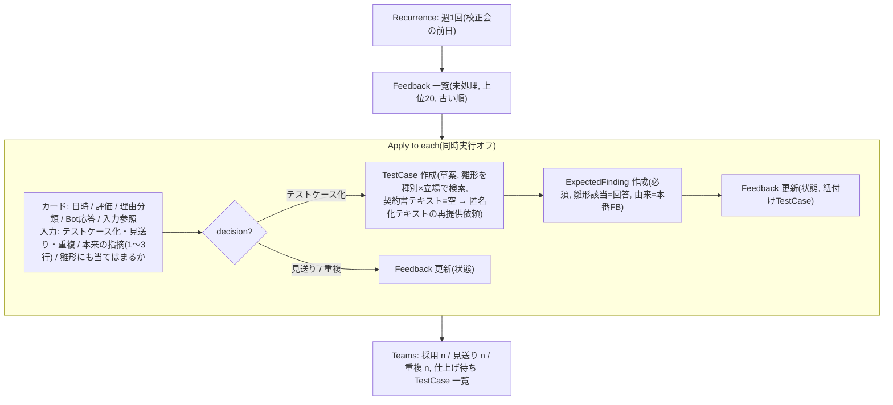

## 9. F6 週次集約(アノテーション活用)

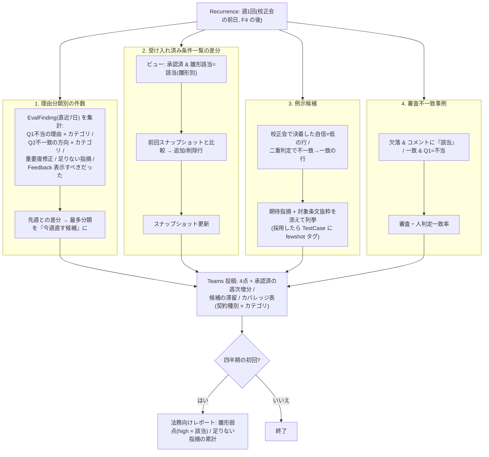

## 10. F0 テストケース登録(任意)

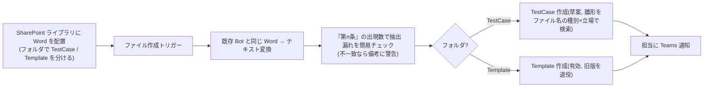

## 11. 期待指摘のライフサイクル

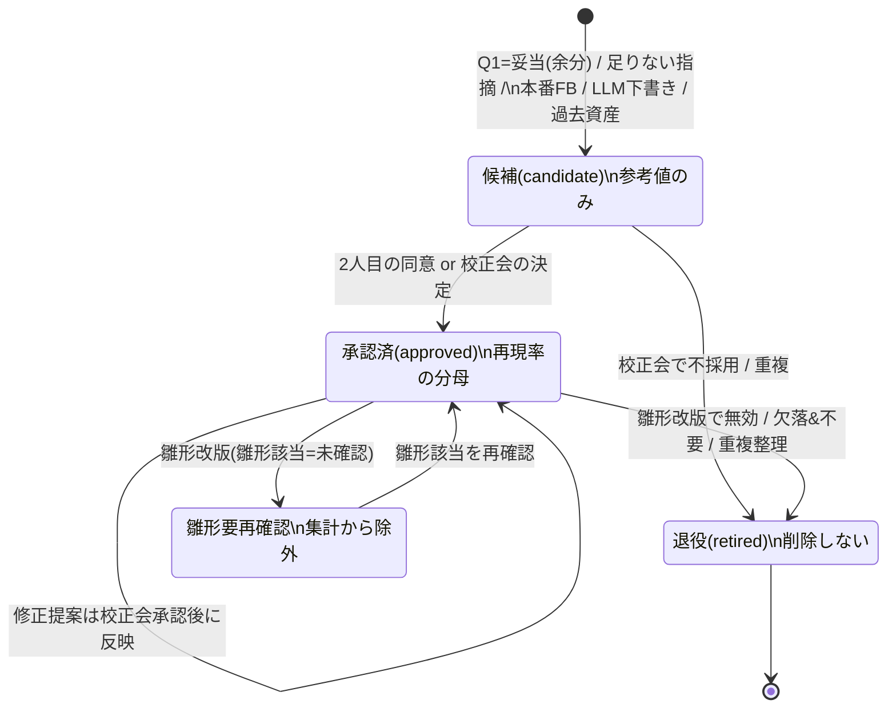

## 12. アノテーション結果の活用

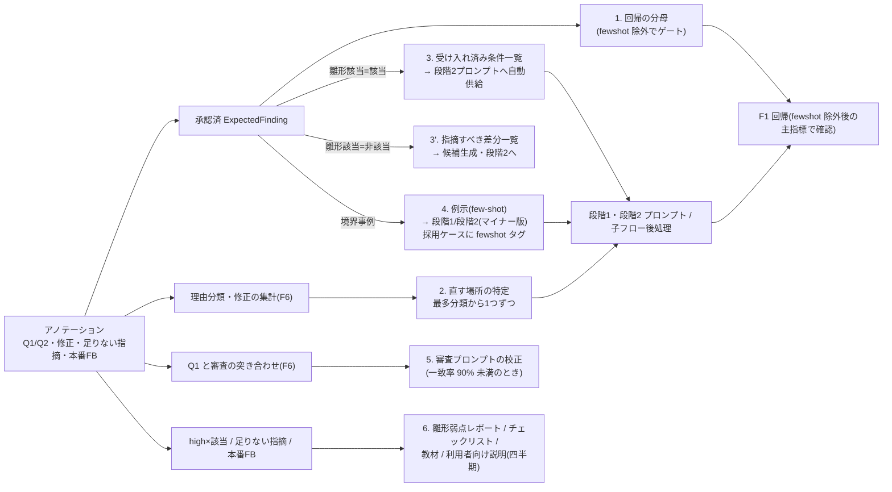

## 13. リリース手順

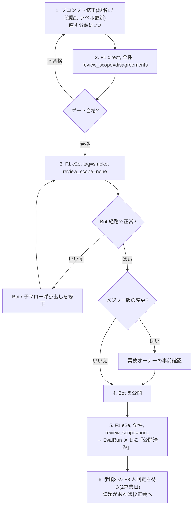

## 図の検証方法

mermaid-cli で全図を描画して構文を確認します(Chromium が必要)。

```bash
mkdir -p /tmp/mmd && npx -y -p @mermaid-js/mermaid-cli mmdc -i docs/09-diagrams.md -o /tmp/mmd/diagrams.md
```

Markdown を入力にすると、各コードブロックが `diagrams-1.svg`, `diagrams-2.svg` … として出力されます。エラーが出た図の番号を直してください。
