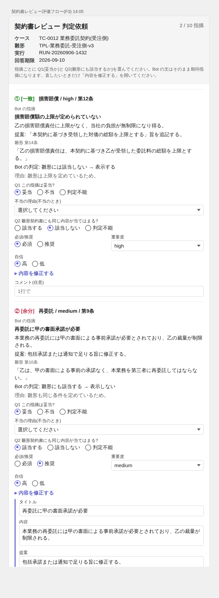
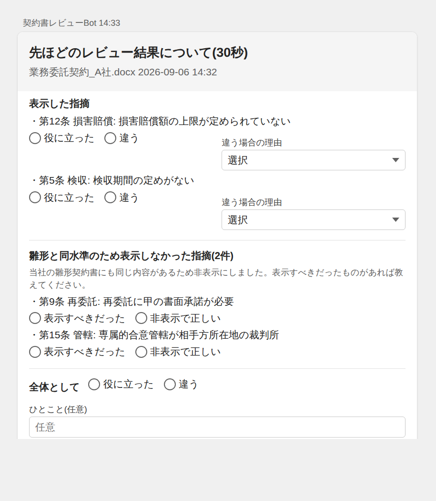
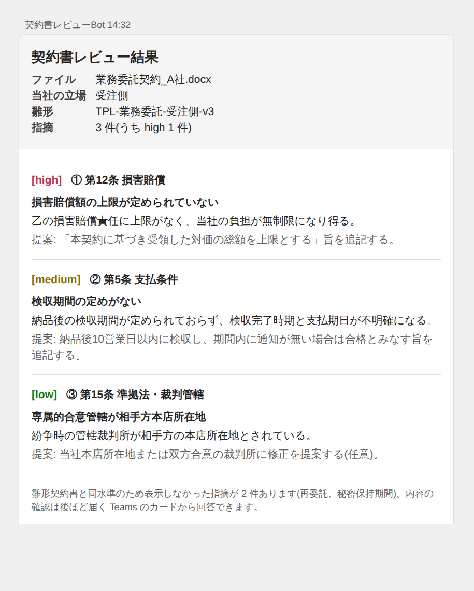

# 10. カード UI とチャネル対応

アノテーションと本番フィードバックに使う Teams アダプティブカードの具体的な UI と、Bot の公開チャネルとの関係をまとめます。
カードの JSON は templates/adaptive_card_f3.json と templates/adaptive_card_f2.json にあり、[Adaptive Cards Designer](https://adaptivecards.io/designer/) に貼り付けてそのまま確認できます。

## 1. チャネル別の対応

カードが出る場所は2種類あり、Bot のチャネルの影響を受けるのは「会話内カード」だけです。

| カード | 出し方 | Teams チャネル | Microsoft 365 Copilot | Web / その他 |
|---|---|---|---|---|
| F3 判定依頼、F4 トリアージ(業務判定者向け) | Power Automate の Teams コネクタ「アダプティブ カードを投稿して応答を待機」で判定者の Teams チャットへ | ○ | ○(Bot のチャネルと無関係) | ○(同左) |
| F2b 本番フィードバック(利用者向け、**既定**) | 子フロー完了後に Power Automate から利用者本人の Teams チャットへ投稿 | ○ | ○ | ○(利用者の UPN が取れれば) |
| F2a 会話内フィードバック(補助) | Copilot Studio のトピックでカードを表示し、回答をトピックで受ける | ○(AC 1.5、入力と Action.Submit 可) | △ 制約あり。ToggleVisibility / OpenURL 未対応、入力付きカードの扱いが限定的。トピックを「アクション」として公開する形では利用者に質問を返せない | チャネル依存 |

結論: **利用者が Microsoft 365 Copilot から使う場合でも、F2b を既定にすれば問題ありません。** 判定者向けカードはもともとチャネル非依存です。F2a は Teams チャネルで公開している場合の補助として残します。

前提チェック(docs/03 0節)に「Bot の公開チャネルと、M365 Copilot の場合の会話内カード制約の確認」を加えています。

## 2. F3 判定依頼カード(業務判定者向け)

### 見た目



上は templates/adaptive_card_f3.json を Teams 風に描画したものです(②は「内容を修正する」を開いた状態)。

### 構成と Adaptive Card 要素

| 位置 | 内容 | 要素 |
|---|---|---|
| ヘッダ | タイトル、n / N 指摘、ケース・雛形・実行・回答期限、1行の説明 | `Container(style=emphasis)`, `FactSet`, `TextBlock` |
| 指摘ブロック(最大10) | 種別バッジ(一致=緑 / 余分=赤 / 欠落=黄)、カテゴリ / 重要度 / 条項 | `ColumnSet`, `TextBlock(color)` |
| | Bot の指摘: タイトル、内容、提案(欠落は「期待していた指摘」) | `TextBlock` |
| | 雛形の該当条項と引用(200 字) | `TextBlock` |
| | Bot の段階2判定と理由 | `TextBlock` |
| | Q1 妥当 / 不当 / 判定不能(初期値: 妥当) | `Input.ChoiceSet(style=expanded)` id `q1_<ID>` |
| | 不当の理由(ドロップダウン) | `Input.ChoiceSet(style=compact)` id `q1r_<ID>` |
| | Q2 該当する / 該当しない / 判定不能(初期値: Bot の判定) | `Input.ChoiceSet(expanded)` id `q2_<ID>` |
| | 必須/推奨(初期値: 期待指摘、無ければ推奨)、重要度(初期値: Bot) | `Input.ChoiceSet` id `req_<ID>`, `sev_<ID>` |
| | 自信 高 / 低 | `Input.ChoiceSet` id `conf_<ID>` |
| | 「内容を修正する」で編集欄を開閉。欄には Bot の文が入っている | `Action.ToggleVisibility` → `Container(isVisible=false)` 内の `Input.Text` id `title_/desc_/sugg_<ID>` |
| | コメント(任意・1行) | `Input.Text` id `comment_<ID>` |
| 末尾 | 足りない指摘(条項、カテゴリ、雛形該当、内容) | `Input.Text` `miss_clause`, `miss_desc`、`Input.ChoiceSet` `miss_cat`, `miss_tpl` |
| ボタン | 送信 | `Action.Submit`(data に evalrun_id, evalresult_id, finding_ids) |

`<ID>` は EvalFinding の GUID(ハイフン除去)を使います。Adaptive Card の入力 id に使えるのは英数字と `_` `-` だけです。

### Teams 上の挙動

- 展開スタイルの選択肢はラジオボタンで横に並びます。画面幅が狭いスマートフォンでは縦に折り返します。
- 「送信」は1回だけ有効です。押すと Power Automate に回答が返り、カードは「回答を受け付けました」の表示に置き換わります。修正は校正会で行います。
- 未回答のまま5日経つとタイムアウトし、次回の F3 で再送されます(人判定依頼済フラグは応答時に立てるので再送は自動)。
- カード全体で 28 KB 程度が上限です。指摘 10 件で約 30〜40 KB になり得るため、`crv_MaxFindingsPerCard` は 6〜8 から始め、引用 200 字・内容 300 字で切ります。
- 選択肢の初期値は「Bot の判定に同意」です。何も触らずに送信しても意味のある回答になります(迷ったら判定不能を選んでもらう)。

### Power Automate での生成方法

1. 対象 EvalFinding を `chunk(対象配列, crv_MaxFindingsPerCard)` で分割し、1チャンク1カード。
2. **Select** で EvalFinding 1件 → 指摘ブロックの JSON 文字列(上の要素をテンプレート文字列に `replace` で埋め込む。JSON 内の改行と `"` は `replace(x, '"', '\"')` でエスケープ)。
3. `join(body('Select'), ',')` でブロックを連結し、ヘッダと末尾ブロックを `concat` してカード JSON を組み立てる。
4. **Teams: アダプティブ カードを投稿して応答を待機**(受信者 = 判定者、メッセージ = カード JSON)。
5. 回答は `body('カード')?['data']` に入力 id をキーにして返る。例: `body('カード')?['data']?['q1_<ID>']`。EvalFinding ごとに `q1_`, `q1r_`, `q2_`, `req_`, `sev_`, `conf_`, `title_`, `desc_`, `sugg_`, `comment_` を取り出して更新する。編集欄は開かなくても Bot の文が value として返るので、値が Bot の文と異なるときだけ「修正あり」とみなす。

## 3. F2b 本番フィードバックカード(利用者向け、Teams 投稿版)

### 見た目



### 構成

| 位置 | 内容 | 要素 |
|---|---|---|
| ヘッダ | 「先ほどのレビュー結果について(30秒)」、ファイル名と時刻 | `Container(emphasis)` |
| 表示した指摘(最大2) | 1行要約、役に立った / 違う、違う場合の理由(ドロップダウン) | `Input.ChoiceSet` id `r_<A#>`, `rc_<A#>` |
| 表示しなかった指摘(最大2) | 「雛形と同水準のため非表示」の説明、1行要約、表示すべきだった / 非表示で正しい | `Input.ChoiceSet` id `h_<A#>` |
| 全体 | 役に立った / 違う、ひとこと | `Input.ChoiceSet` `overall`, `Input.Text` `overall_comment` |
| ボタン | 送信 | `Action.Submit`(data に conversation_id, prompt_version, shown_ids, hidden_ids) |

- 30 秒で答えられる量に絞ります。表示指摘は `ask_feedback = true` を子フローが付けた最大 2 件(段階2の理由が短い、カテゴリの教師データが少ないものを優先)、非表示指摘は最大 2 件。
- 非表示指摘の「表示すべきだった」は誤抑制の本番ラベルです。最終出力には出ないため、このカードが本番で誤抑制を見つける唯一の入口です。
- 送信先は子フローに渡した利用者の UPN(Copilot Studio の `System.User.Email` などチャネルで取れる識別子)。取れないチャネルでは F2b は送らず、会話単位の質問だけにします。
- タイムアウト 3 日。未回答は記録せず終了(催促しない)。

### 回答の記録

回答 1 件につき Feedback 行を 1 行作ります(docs/02 7節)。`r_<A#>` → 評価と理由分類、`h_<A#>` → 評価(表示すべきだった / 非表示で正しい)と 非表示指摘か = はい、`overall` → 指摘 JSON が空の会話単位の行。

## 4. F2a 会話内カード(Teams チャネルのみの補助)

Teams チャネルで公開している場合は、レビュー結果の直後に同じ内容のカードをトピックから表示し、「質問(Adaptive Card で質問)」ノードで回答を受けて F2 を呼ぶこともできます。M365 Copilot では動作が保証できないため、既定は F2b です。両方を有効にする場合は、F2a に回答があった会話には F2b を送らないよう、子フローの出力に `feedback_sent` を持たせて制御します。

## 5. Markdown 表からカードへの移行

現行 Bot はレビュー結果(段階2で残った全指摘)を Markdown の表で出力しています。カードに移す手順です。

### 5.1 前提: 表の文字列を「指摘 JSON」にする

Markdown の表は1本の文字列で、カードの部品にできません。カードは指摘1件ごとの構造化データから組み立てます。これは docs/01 5節の構造化出力と同じもので、評価ループ(F1 の審査、EvalFinding)の前提でもあります。

| 現状 | 修正 |
|---|---|
| LLM が表を直接生成している | プロンプトの出力指示を templates/findings_schema.json の JSON に変える。表は JSON からフロー側で生成する。段階2は「削除」ではなく `applies_to_template` フラグ付きで全件返す |
| フローが配列から表を組み立てている | 配列を JSON 文字列として子フローの出力に追加するだけ |
| すぐにプロンプトを変えられない | 暫定策として `split(表, '\n')` → 各行を `split(行, '|')` で配列に戻す。LLM の列ずれで壊れやすいので、つなぎに限定する |

### 5.2 子フローの出力を追加する

| 出力 | 用途 |
|---|---|
| `findings_json` | 指摘配列(全件 + 段階2判定)。カードと評価の元データ |
| `card_json` | フロー側で組み立てたレビュー結果カード(templates/adaptive_card_result.json の形)。`applies_to_template = false` の指摘だけを載せる |
| `display_text` | 既存の Markdown 表。カード非対応チャネルの代替と詳細表示用に残す |

カードの組み立ては F3 と同じです。Filter array(非該当のみ)→ Select で指摘1件を Container の JSON 文字列に → `join` で連結 → ヘッダと注記を `concat`。Markdown 表もカードも同じ JSON から生成するので、内容がずれません。

### 5.3 トピックのメッセージノードをカードに差し替える

Markdown を出している「メッセージを送信」ノードを、アダプティブカード付きのノードに変えます。

**A. フローが組み立てた `card_json` をそのまま出す(推奨)** … カードノードを数式モードにして `ParseJSON(Topic.card_json)` を指定する。見た目をフロー側だけで管理でき、F3 カードと部品を共有できる。

**B. Power Fx の ForAll で組み立てる** … `ParseJSON(Topic.findings_json)` をテーブルにして、指摘ごとに Container を生成する。

```
{
  type: "AdaptiveCard", version: "1.5",
  body: ForAll(
    Table(ParseJSON(Topic.findings_json).findings),
    {
      type: "Container", separator: true,
      items: Table(
        { type: "TextBlock", wrap: true, weight: "Bolder",
          text: "【" & Text(Value.severity) & "】" & Text(Value.clause_ref) & " " & Text(Value.category) & ": " & Text(Value.title) },
        { type: "TextBlock", wrap: true, text: Text(Value.detail) },
        { type: "TextBlock", wrap: true, isSubtle: true, text: "提案: " & Text(Value.suggestion) }
      )
    }
  )
}
```

どちらも数式モードの `ParseJSON` を使うため、テナントのバージョンで動作を確認してください。

### 5.4 レビュー結果カードの構成



- 「表」ではなく **指摘ごとの箱** にします。Adaptive Card 1.5 には Table 要素がありますが、スマートフォンでは列が潰れ、Microsoft 365 Copilot での対応も不安定です。
- 1件ごとに 重要度バッジ(high=赤 / medium=黄 / low=緑)、条項、カテゴリ、タイトル、内容、提案 を縦に並べます。
- 末尾に「雛形と同水準のため表示しなかった指摘が n 件」の注記を入れます。入力は付けず読み取り専用にするので、Microsoft 365 Copilot でも表示できます。
- JSON は templates/adaptive_card_result.json。

### 5.5 フィードバックの付け方(チャネル別)

- **Teams チャネル**: 結果カードに指摘ごとの「役に立った / 違う」と非表示指摘の折りたたみを載せられる(F2a)。
- **Microsoft 365 Copilot**: 結果カードは表示だけにし、ボタンは F2b(子フロー完了後に Power Automate から利用者の Teams へ投稿)で出す。

### 5.6 サイズ対策

Teams のカードは 28 KB 程度が上限です。指摘が 8 件を超えると内容と提案を含めた1枚に収まらないことがあります。

- 「カード = 重要度・条項・タイトルの一覧」「Markdown 表 = 詳細」の2通に分ける、または
- 指摘 6 件ごとに複数のカードに分割する(`chunk()`)。

### 5.7 作業の順番

1. プロンプトの出力を JSON 化し、フローで Markdown 表を JSON から生成する(表の見た目は変えない)。ここで回帰評価(F1)も動き始める。
2. 子フローに `findings_json` と `card_json` の出力を追加する。
3. トピックのメッセージノードをカードに差し替える。Teams と Microsoft 365 Copilot の両方で表示を確認する。
4. Teams チャネルなら F2a、Microsoft 365 Copilot なら F2b でフィードバックを追加する。

## 6. モックアップの更新方法

docs/images/card_f3_mock.html、card_f2_mock.html、card_result_mock.html は templates の JSON から生成した HTML です。JSON を変えたら同じ手順で再生成します。

```bash
# Chromium で描画(docs/09 末尾の mermaid と同じ Chromium)
/opt/pw-browsers/chromium-*/chrome-linux/chrome --headless=new --no-sandbox --hide-scrollbars \
  --force-device-scale-factor=1.5 --window-size=610,1660 --screenshot=docs/images/card_f3.png file://$PWD/docs/images/card_f3_mock.html
```

HTML はサブセット描画(Container / ColumnSet / TextBlock / FactSet / Input.ChoiceSet / Input.Text / ToggleVisibility)です。実機の見た目は Teams のテーマに従います。
